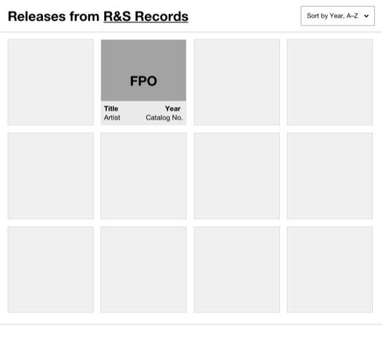

# Discogs Frontend Exercise

The goal of this exercise is to build an interface that displays a responsive
grid of Releases fetched from an API that can be sorted by either Release title
or Release year.

You can use the mocked API in `src/data.ts` to fetch the release data.

## Requirements
The finished solution **should**:
- Be implemented in Typescript or plain JavaScript and React.
- Display cards with the following information:
  - title,
  - artist,
  - year,
  - catalog number
- Each card should act as a link to the Release on Discogs (eg. `https://www.discogs.com/release/{id}`)
- Be responsive.
- Allow cards to be sorted by release title or release year.
- Follow the general wireframe layout as above. Do feel free to make it look better if
  you can.
- Have unit/integration tests where you think they matter. 100% coverage is not
  required.
- The interface should have a loading state and handle potential API errors.
- Implement good WAI-ARIA practices where applicable.
- Contain notes about decisions you made.

## Submission
To submit your solution:
- Create a private Github Repository that contains your code
- [Invite](https://docs.github.com/en/github/setting-up-and-managing-your-github-user-account/managing-access-to-your-personal-repositories/inviting-collaborators-to-a-personal-repository)
  **mrlarner** and **romeovs** as contributors
- Let us know you have finished the solution

Please reach out to me with any questions!
